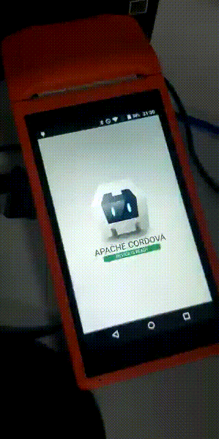

    

# cordova-plugin-sunmi-inner-printer-si
Cordova/Ionic Plugin for Sunmi V2 Printer

Tested with cordova-android >= 7.1.0

Plugin based on https://github.com/eusilvio/cordova-plugin-sunmi-inner-printer

#### Changelog 2024-06-25

1. Automatically add `"com.sunmi:sunmiui:latest.release"` into gradle.

2. Replaced `canvas.save(Canvas.ALL_SAVE_FLAG)` with `canvas.save()` on `BitmapUtils.java`

3. Updated the `AIDL` with `version 2.1`

4. Add the `android:exported="true"` in `receiver` and `service` in the `manifest`

5. Add xmlns:tools="http://schemas.android.com/tools in te service

#### DOCS

in preparation